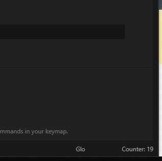
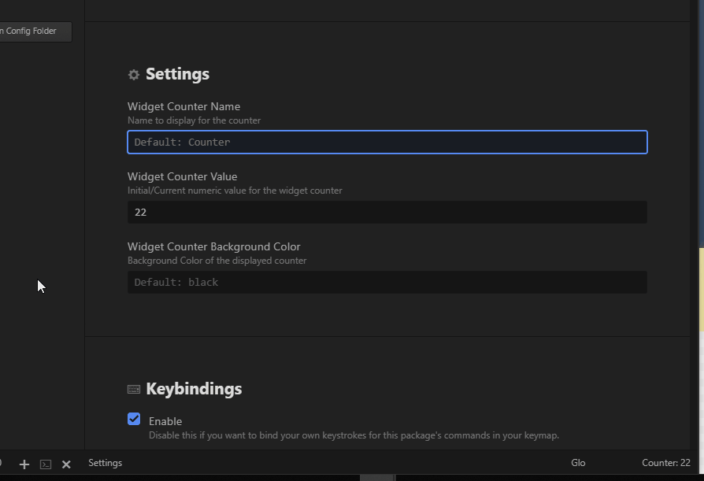
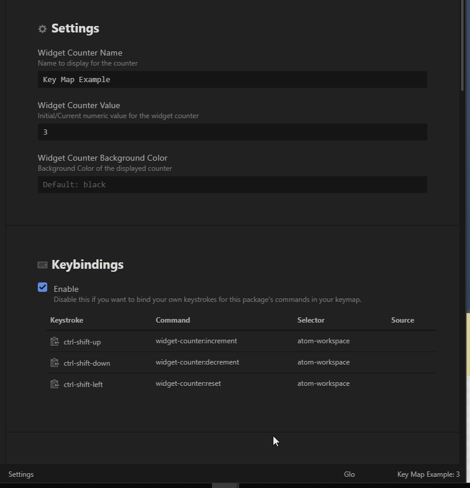
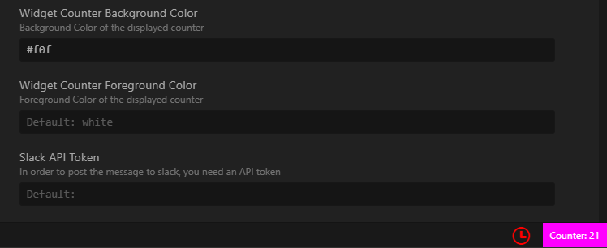
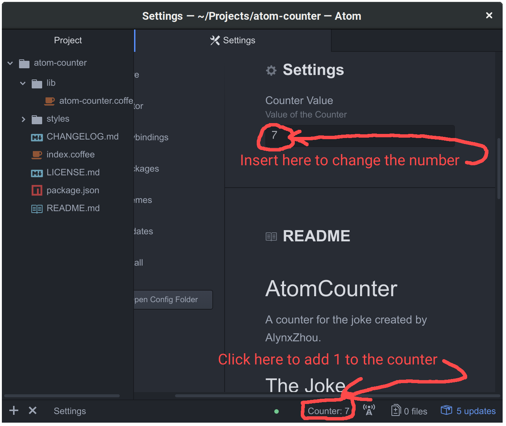

# Widget Counter

  

  

It's a meta-counter that can count every thing you do with or without Atom, a hackable text editor for the 21st centery, with a hackable counter.  
A widget counter intended as a joke originally created by AlynxZhou.  
This version is a fork of AlynZhou's, thank you for your intial hard work on all of this.  
This Atom.io plugin was converted to JS sourcecode from CoffeeScript, sorry still learning Coffeescript.  
Updates include the ability customize the name of the counter, reset the counter, increment and decrement the counter and some additional hotkeys for quick usages.
A great little tool to help count things, whether its a joke or soemthing a bit more serious that doesn't need to be fully recorded elsewhere.

## The Joke
---
- Chinese Version

  我看到 Hackghost 的桌面上有一个计数器，上面显示数字“233”，于是我好奇地去问他这个计数器代表什么意思。他回答说：“这个数字代表了我今天被蠢货们打断了工作的次数”。说完他又按了一下计数器按钮，于是现在数字变为“234”了。

- English Version Translated by AlynxZhou

  I saw a counter on Hackghost's desktop showing a number "233", and I asked him what it means curiously. He said "That represents how many times I was interrupted by idiots today". After speaking he pressed the button of the counter again, and then the number became "234".

## Usage

Click the counter on the status bar to add 1 and count a **WIDGET** you want to count, including your coding hours, your drinking times, times interupted, times your coworker coughed in your face, etc.  
Reset the counter to 0 in the settigs.  Additionally, you can use the hotkeys to reset things, or use them to quickly increment and decrement the count.  
Use the settings to also change the name of the counter displayed in the statusbar.  

Click the counter area in the lower right on the status bar.  

You can edit the name of the counter to be more appropriate, or more discrete as well.  

Using the hotkeys to quickly increment, decrement and reset everything.  

Change color of widget counter, both the foreground and background.  Accepts standard color words, and html hex values.  

## Images

## Features

1. Click the counter on the bottom status bar to increment the count
2. Use the settings to change the display name of the counter
3. Use the settings to reset or change the value of the counter
4. Use the Hotkey (`ctrl-shift-up/uparrow`) to increment
5. Use the Hotkey (`ctrl-shift-down/downarrow`) to decrement
6. Use the Hotkey (`ctrl-shift-left/leftarrow`) to reset to zero
7. Ability to customize and change the foreground and background of the counter area
8. Connect to Slack (optional), add token and message and the slack channel to the settings, and it will post new counts there

## To Do

- Support for multiple widgets (?)
- New requests (?)

Any other feature requests, please go to the GitHub Issues page and submit a feature request, or join the community and support the project by contributing.

## Issues

The application is hosted on GitHub.  Please go to the GitHub Issues page, search for your issue.  If you see the same issue listed, please comment and add to the thread.  Otherwise, feel free to add another issue.  

**NOTE:**  
Hotkeys / keymap / keybindings were a bit tricky.  The desired use was `ctrl-alt-up`,`ctrl-alt-down`,`ctrl-alt-left` or `ctrl-alt-+`,`ctrl-alt--`,`ctrl-alt-0`.  
In general, there seems to be some issues with `ctrl-alt-[arrow key]` ceaslessly firing if you hold down the `ctrl-alt` and alternate between `up` and `down` arrows, causing issues with the program.  There are other forums and posts and issues on other atom.io repos and such that people have had the same or similar issue.  The 'ctrl-alt-+` and ctrl-alt--` turned out to be an annoyance because of different keyboards.  
Some keyboards with a 9-pad recognize the `-` and `+` as the same when `ctrl` or `alt` or both are pressed and others do not.  Some recognize it as `insert` or `end` or something else, causing some issues and inconsistent tests.  I opted for the `ctrl-shift` instead for up/down and `ctrl-shift-alt` for the reset as `ctrl-shift-left` and `ctrl-shift-right` are more for selecting words.  This seems to work across the board.  
Please feel free to disable this or change this to suit your needs.  

## Contributing

Pull requests are welcome.  Please see the guidelines in the CONTRIBUTING.md document.  This community does have a code of conduct associated with contributions.  I am open to changes, updates and fixes.  Please, open an issue first to discuss what the change is, and then follow the guidelines.  
Always feel free to help out, whether its filing out [a bug report](https://github.com/KeithETruesdell/widget-counter/issues/new?labels=bug), [a feature request](https://github.com/KeithETruesdell/widget-counter/issues/new?labels=enhancement), working on an update or even forking your own version and making it better.  
Atom's [contributing guide](https://github.com/atom/atom/blob/master/CONTRIBUTING.md) will help get you started while the [guide for contributing to packages](https://github.com/atom/atom/blob/master/docs/contributing-to-packages.md) has some extra information.

## License

MIT Licesnse.  See the the [license](https://github.com/KeithETruesdell/widget-counter/LISENCE.md) for more details.

## Thank you

A special **THANK YOU** to all those that helped with snippett and the contributors of this project!

[Alynx Zhou](https://github.com/AlynxZhou) (Original creator - thank you!)

## Donations

